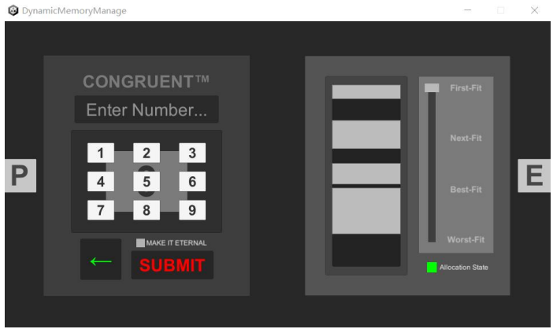
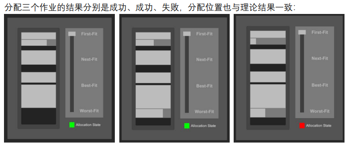
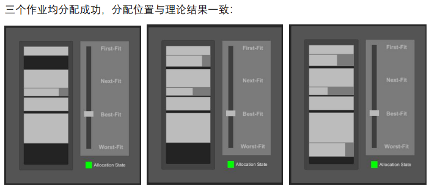

# 基于Unity的动态分区存储管理可视化程序

开发环境：unity 2021LTS

支持首次适配法、下次适配法、最佳适配法、最坏适配法这四种不同分区分配算法。

程序初始界面：



可见有些内存块已被永久分配。这是测试分区分配算法时留下的，您也可以根据自己的需求进行自定义初始化。要做到这一点，需要前往MemoryController.cs脚本，并修改Start方法的内容。现有的效果对应的代码如下：

```C#
void Start()
{
    processEternal = false;
    TryAllocate(30,10);
    TryAllocate(40,-1);
    TryAllocate(20,10);
    TryAllocate(30,-1);
    TryAllocate(5, 10);
    TryAllocate(65,-1);
    TryAllocate(46,10);
    processEternal = true;
    latestAllocated = idleLinkedList.First;
}
```

TryAllocate方法的第一个参数是欲分配的内存尺寸，第二个参数是该内存块在被释放前的最长存在时间（-1则为永久分配，不会释放）。

左侧数字面板可输入欲分配的内存尺寸，目前暂未实现在用户界面自定义最长存在时间，默认为10s。勾选框的值决定新内存块是否会被永久分配。使用SUBMIT按键即可尝试分配内存。

右侧滑动条的值决定当前系统使用何种分区分配算法，指示灯表示上一个内存分配请求是否成功。

## 使用示例

内存总大小 256K，OS 占据 20K。假设作业序列：作业 A 要求 18K，作业 B 要求 25K，作业 C 要求 30K。

### 首次适配法



### 最佳适配法

